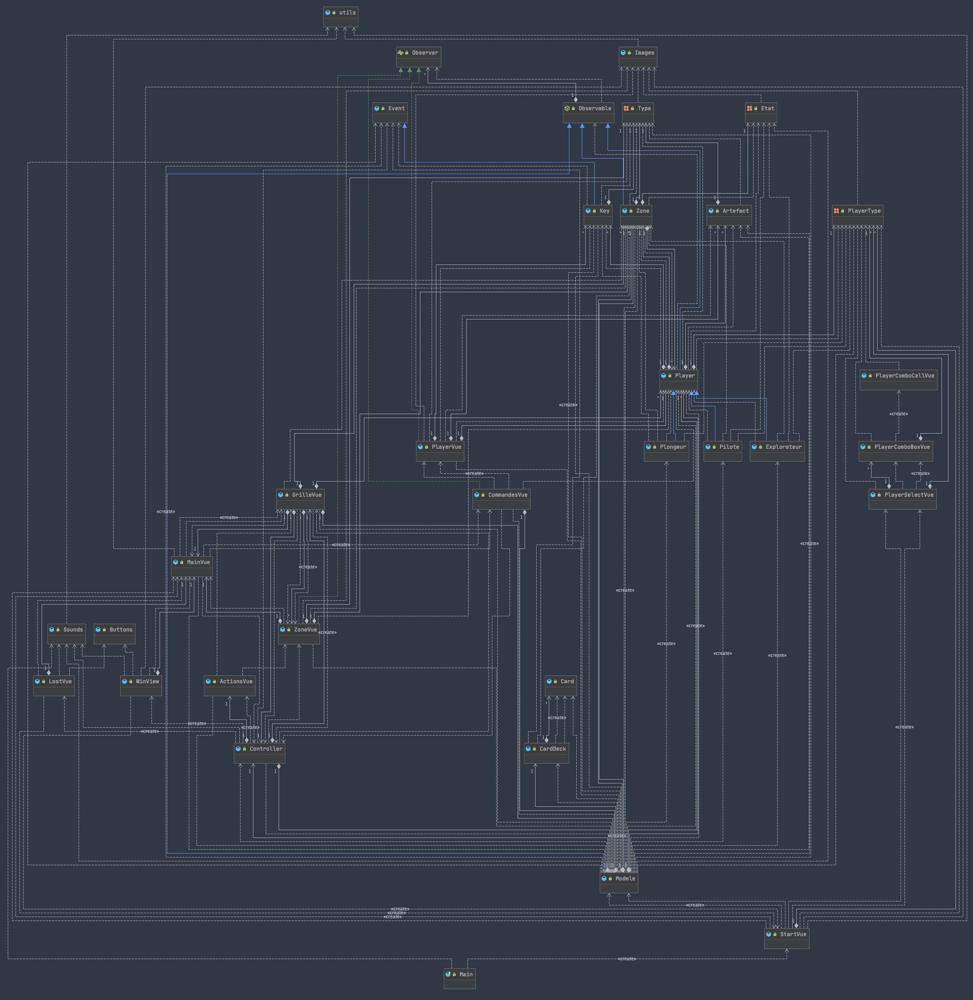

# Ile Interdite

## Choix
- Chaque joueur spawn sur une case aléatoire
- Il y a 4 clés par partie (une pour chaque artéfact)
* Une défaite est détectée si :
    * Tous les joueurs sont morts
    * Un joueur avec une clé ou un artefact est mort
    * Si l'héliport est submergé
    * Si un artefact est submergé et qu'aucun plongeur ne possède la clé de cet artefact

## Améliorations du sujet réalisées
- Ajout du Pilote
- Ajout de l'Explorateur
- Ajout du Plongeur
- Simulation d'un vrai paquet de cartes

## Autres améliorations
- Difficulté modulable : la difficulté (*notée Diff*) est le nombre de cartes "clés" sur le nombre total de cartes (*noté TotCartes*) 
(clé, rien ou montée des eaux). On a fait le choix de n'avoir qu'une clé par artefact, 
il y a donc toujours 4 cartes "clés". On ajuste le nombre de cartes des deux autres évènement pour que 
```Diff = 4 / TotCartes```
- Sons : un son spécifique est attribué à chaque action et évènement.
- Écran de fin : un écran de fin est affiché en fonction de la finalité de la patie (victoire ou défaite)

## Diagramme de classe


## Instructions d'exécution
Afin de pouvoir compiler et lancer l'application dans votre IDE, il faut ajouter JavaFX a votre
classpath (les `.jar` sont dans `lib`) et il faut ajouter les options suivantes à la VM:

```shell script
--module-path $ProjectFileDir$/lib/javafx-sdk-14.0-2.1/lib
--add-modules javafx.controls,javafx.media
```
